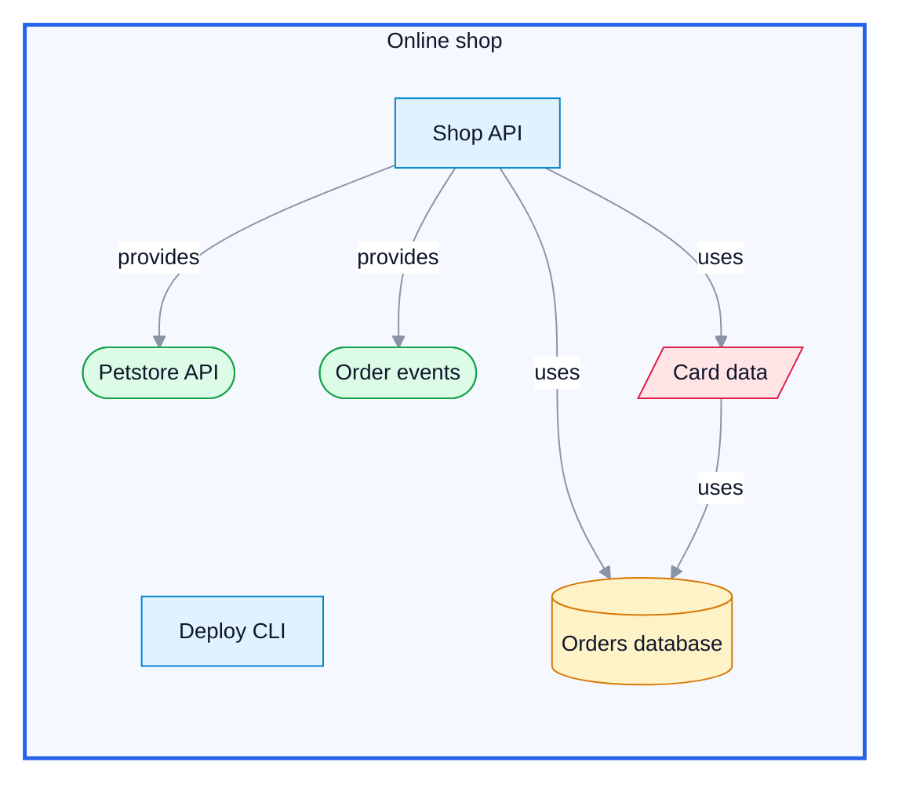

# Online shop — containers

<!-- Diagram of the software catalog, exported by SDD Studio. To change it, open the catalog,
     choose the entities on the Diagram page and export again over this file. -->

